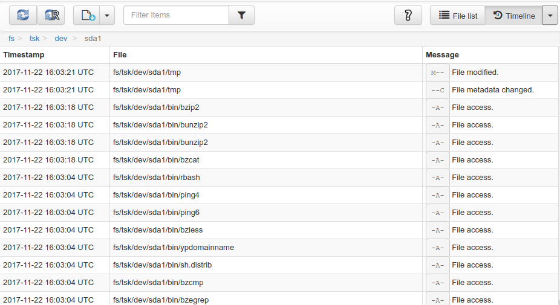

# Creating Timelines #

The GRR VFS can be switched to a timeline view where all files *GRR knows about* are shown sorted by their various timestamps:



Use the button on the top right in the VFS view to switch between Timeline and File List View. The drop down menu can be used to download the generated timeline as CSV.

Note that

- the timeline is always generated by recursively descending into directories starting from the currently selected one.
- the timeline only contains files that GRR has downloaded metadata before. This timelining mechanism is fully server side, if you haven't collected the metadata yet, the recursive refresh button will do this for you.

## TimelineFlow ##

The `TimelineFlow` provides a one-click solution for retrieving a snapshot (stat information for each file) of the entire filesystem. Once collected, the snapshot can be downloaded in [Sleuthkit's Body format](http://wiki.sleuthkit.org/index.php?title=Body_file) for further analysis.

To use the `TimelineFlow`:

1. Start a `TimelineFlow` (can be found in `Collectors > Timeline`)

1. Once completed, run the GRR API shell to download the results:

   ```python
   from grr_response_proto.api import timeline_pb2
   grrapi.Client('C.0123456789abcdef').Flow('12345678') \
       .GetCollectedTimeline(fmt=timeline_pb2.ApiGetCollectedTimelineArgs.BODY) \
       .WriteToFile('/tmp/out.body')
   ```
